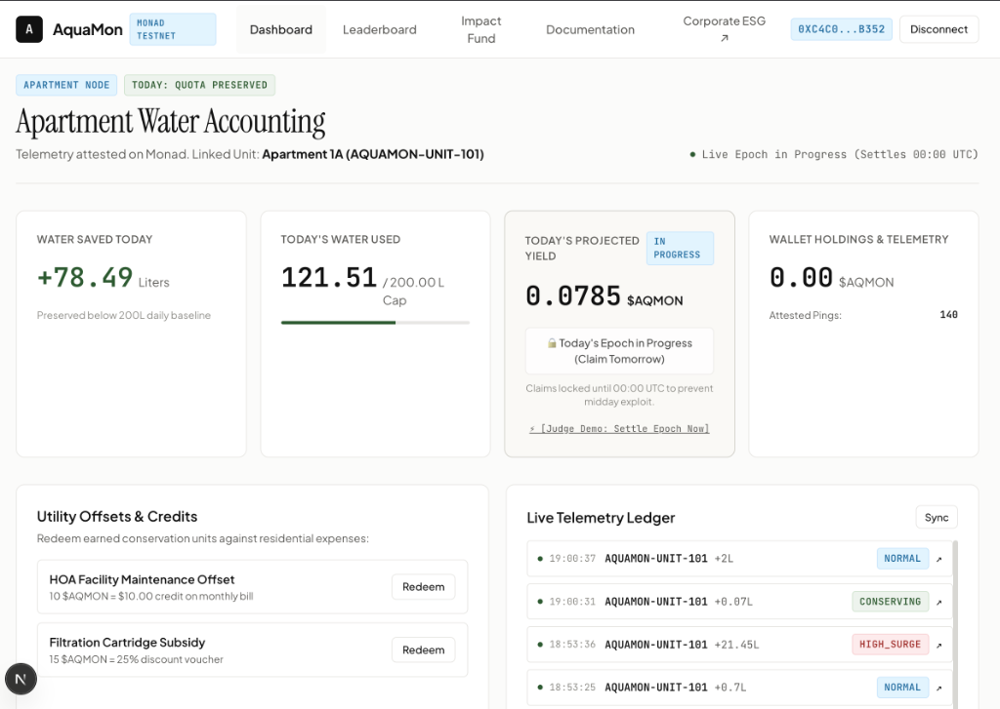
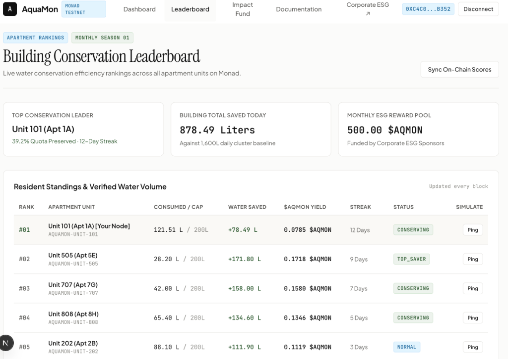
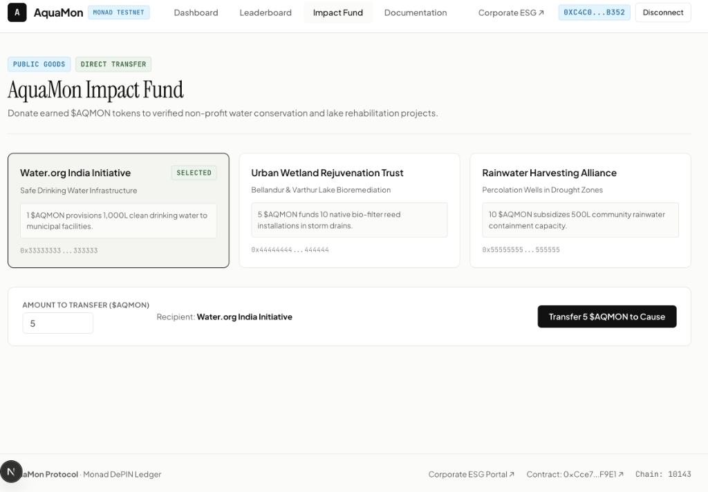
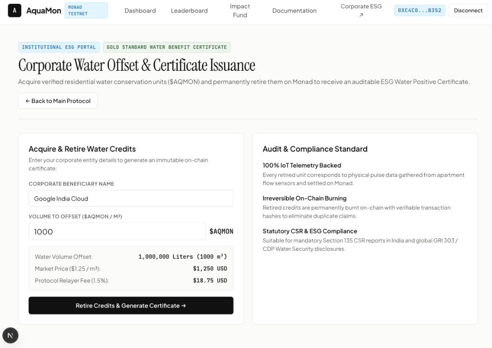
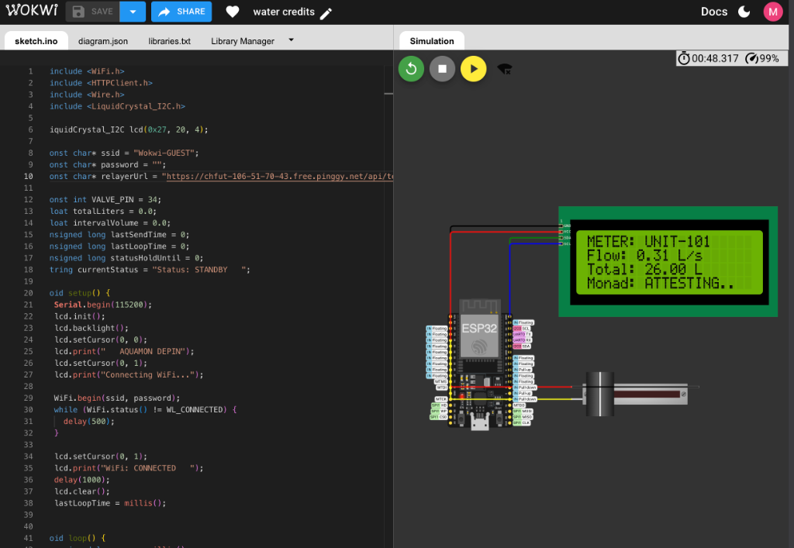

# 🌊 AquaMon Protocol — Verifiable Water Conservation DePIN on Monad

> **The Decentralized Physical Infrastructure Network (DePIN) turning residential water conservation into Gold Standard Water Benefit Certificates ($AQMON) with parallel EVM consensus on Monad.**

[](https://monadscan.com/)
[-836EF9?style=flat-square)](https://testnet.monadexplorer.com/)
[](https://aquamon-alpha.vercel.app/)
[](https://wokwi.com/projects/472508191464530945)
[](https://opensource.org/licenses/MIT)

---

## 📌 Executive Summary & Pitch Checklist

| Pitch Item | Monad Mainnet & Testnet Deployments |
|---|---|
| **Protocol Name** | **AquaMon** |
| **Token Symbol** | **`$AQMON`** (ERC-20 on Monad) |
| **🔥 Monad Mainnet Contract** | [`0x89afB0868412194E65834b9029918Cfb4c6aB177`](https://monadscan.com/address/0x89afB0868412194E65834b9029918Cfb4c6aB177) |
| **⚡ Monad Testnet Contract** | [`0xCce77B7F4b4D0628c4da66F7Aa9e2a78e598F9E1`](https://testnet.monadexplorer.com/address/0xCce77B7F4b4D0628c4da66F7Aa9e2a78e598F9E1) |
| **Monad Explorer Contract** | [View on MonadVision / MonadExplorer ↗](https://testnet.monadvision.com/address/0xCce77B7F4b4D0628c4da66F7Aa9e2a78e598F9E1) |
| **🌐 Live Web Application** | [https://aquamon-alpha.vercel.app/ ↗](https://aquamon-alpha.vercel.app/) |
| **🕹️ Live Wokwi Hardware Lab** | [https://wokwi.com/projects/472508191464530945 ↗](https://wokwi.com/projects/472508191464530945) |
| **Networks & Chain IDs** | **Monad Mainnet** & **Monad Testnet (Chain ID: `10143`)** |
| **Relayer Proxy Gateway** | `http://localhost:3000` (`/api/telemetry`, `/api/stats`, `/api/pair-device`) |
| **Standard Compliance** | **Gold Standard Water Benefit Certificate (1 m³ / 1,000 L saved = 1 $AQMON)** |

---

## 💡 The Problem & The Monad Solution

### The Real-World Crisis
* Rapid urban water depletion forces residential complexes to spend thousands of dollars monthly on commercial water tankers.
* Traditional water utilities lack real-time accountability: residents have zero incentive to conserve water, fix leaks, or monitor consumption.
* Corporate ESG & CSR mandates suffer from greenwashing and untraceable paper offsets.

### The AquaMon Solution on Monad
1. **IoT Edge Pulse Telemetry**: Low-cost ESP32 microcontrollers and LoRaWAN smart meters measure real-time flow rate per apartment.
2. **Zero-Gas Relayer Proxy**: The AquaMon Relayer batches and sponsors gas fees on Monad so residents pay **$0.00** when using their taps.
3. **High-Throughput Parallel Settlement**: Monad's 10,000 TPS and 400ms block times enable continuous IoT telemetry streaming across thousands of apartment units simultaneously.
4. **Anti-Exploit Daily Epoch Tokenomics**: Rewards are mathematically minted **only for water SAVED below the 200L daily baseline**. Midday exploitation is impossible because claims unlock after daily epoch finalization.
5. **Corporate ESG Retirement Engine**: Corporations buy and permanently burn `$AQMON` on-chain to offset their water footprint, receiving downloadable high-resolution audit certificates with immutable Monad transaction hashes.

---

## 🖼️ Application Walkthrough & Visual Tour

### 1. 📊 Residential Apartment Node Dashboard

* **Real-Time Water Accounting**: Links physical ESP32 pulse meters (`AQUAMON-UNIT-101`) to resident EVM wallets on Monad.
* **Daily Quota Preservation Bar**: Visualizes real-time water consumed (`121.51 / 200.00 L`) vs water preserved (`+78.49 Liters`).
* **Anti-Exploit Daily Epoch Yield**: Accrues `$AQMON` rewards strictly for water preserved below baseline. Rewards remain locked as *In Progress* until daily midnight auditing to prevent midday consumption gaming.
* **Live Telemetry Ledger**: Displays incoming hardware pulses, flow classification tags (`CONSERVING`, `NORMAL`, `HIGH_SURGE`), and clickable Monad block explorer transaction receipts (`↗`).

---

### 2. 🏆 Building Conservation Leaderboard

* **Live Apartment Standings**: Recalculates resident rankings, daily streaks, and quota preservation percentages on every Monad block.
* **Cluster Level Insights**: Aggregates total water preserved across the entire complex (`878.49 Liters saved today`) against baseline capacity.
* **Parallel Execution Simulator**: Interactive triggers simulate simultaneous telemetry ingestion across multiple apartment units (`Unit 101` through `808`), showcasing Monad's 10,000 TPS parallel EVM throughput.

---

### 3. 💧 AquaMon Public Goods Impact Fund

* **Direct On-Chain Philanthropy**: Enables eco-conscious residents to donate earned `$AQMON` credits directly to verified non-profit water trusts (*Water.org India*, *Urban Wetland Rejuvenation Trust*, *Rainwater Harvesting Alliance*).
* **Tangible Environmental Impact**: Every 1 `$AQMON` transferred provisions 1,000 Liters of clean drinking water to underserved municipal facilities.

---

### 4. 🏢 Corporate ESG & Water Positive Retirement Portal

* **Institutional CSR Offsets**: Corporations acquire and permanently retire `$AQMON` water benefit certificates to fulfill mandatory ESG disclosures (GRI 303 / CDP Water Security).
* **Cryptographic Retirement Proof**: Retired credits are permanently burned on Monad, generating immutable on-chain certificates with verifiable burn transaction hashes.

---

### 5. 🕹️ Interactive ESP32 Smart Water Meter Hardware (Wokwi Simulation)

* **Live Hardware Emulation**: ESP32 microcontroller running Arduino C++ firmware paired with an I2C 20x4 LCD screen and a linear potentiometer slide valve.
* **Instant State Feedback**: LCD displays live telemetry (`METER: UNIT-101`, `Flow: 0.31 L/s`, `Total: 26.00 L`, `Monad: ATTESTING..` $\rightarrow$ `Monad: ATTESTED OK`).
* **Sub-Second Transmission**: Streams encrypted pulse data every 800ms directly to the AquaMon Relayer over an active HTTPS tunnel.

---

## 🏗️ End-to-End System Architecture

```
┌────────────────────────────────┐
│   Physical Smart Water Meter   │  (ESP32 + Hall Effect Pulse Sensor / Wokwi)
│   (e.g., Unit 101, Apt 1A)     │  Measures flow pulses in real time (e.g. 0.45 L)
└───────────────┬────────────────┘
                │  HTTPS / Cryptographic Enclave Payload
                ▼
┌────────────────────────────────┐
│   AquaMon Relayer Proxy        │  • Maps Device ID ↔ Resident EVM Wallet
│   (Port 3000 Node.js Engine)   │  • Sponsors 100% Gas on Monad Parallel EVM
└───────────────┬────────────────┘
                │  recordTelemetry(residentWallet, litersScaled)
                ▼
┌────────────────────────────────┐
│   Monad Smart Contract         │  • Mainnet: 0x89afB0868412194E65834b9029918Cfb4c6aB177
│   (Mainnet & Testnet)          │  • Testnet: 0xCce77B7F4b4D0628c4da66F7Aa9e2a78e598F9E1
│                                │  • Tracks cumulative water & audits 200L quota
└───────────────┬────────────────┘
                │  getResidentStats() / claimTokens() / burn()
                ▼
┌──────────────────────────────────────────────────────────────────────────┐
│                          AquaMon Web Portal                              │
│                (Live at https://aquamon-alpha.vercel.app/)               │
│                                                                          │
│  ┌───────────────────────────┐         ┌──────────────────────────────┐  │
│  │   Resident Dashboard      │         │   Corporate ESG Portal       │  │
│  │ • Water Saved Today Meter │         │ • Acquire $AQMON Offset Units│  │
│  │ • Daily 200L Quota Bar    │         │ • Irreversible On-Chain Burn │  │
│  │ • Epoch Claim Lifecycle   │         │ • Downloadable PNG/PDF Certs │  │
│  │ • HOA Bill Redemptions    │         │ • CSR Compliance Audits      │  │
│  └───────────────────────────┘         └──────────────────────────────┘  │
└──────────────────────────────────────────────────────────────────────────┘
```

---

## 🔐 Environment Variables & Secret Configuration

Copy the provided `.env.example` templates to `.env` in each module:

### 1. Frontend (`frontend/.env.local`)
```env
# Para SDK Web3 Authentication API Key
NEXT_PUBLIC_PARA_API_KEY=beta_304e92ef208bef18c1122e3f3eb6a177

# AquaMon Verified Smart Contract on Monad Testnet
NEXT_PUBLIC_CONTRACT_ADDRESS=0xCce77B7F4b4D0628c4da66F7Aa9e2a78e598F9E1

# AquaMon Verified Smart Contract on Monad Mainnet
NEXT_PUBLIC_MAINNET_CONTRACT_ADDRESS=0x89afB0868412194E65834b9029918Cfb4c6aB177

# Monad Public RPC Endpoint
NEXT_PUBLIC_MONAD_RPC_URL=https://testnet-rpc.monad.xyz

# AquaMon Relayer Gateway URL (Localhost or active HTTPS Tunnel)
NEXT_PUBLIC_RELAYER_URL=http://localhost:3000
```

### 2. Relayer Proxy Engine (`relayer/.env`)
```env
PORT=3000
MONAD_RPC_URL=https://testnet-rpc.monad.xyz
PRIVATE_KEY=your_relayer_sponsor_private_key_here
CONTRACT_ADDRESS=0xCce77B7F4b4D0628c4da66F7Aa9e2a78e598F9E1
```

### 3. Multi-Unit IoT Simulator (`iot-simulator/.env`)
```env
RELAYER_URL=http://localhost:3000/api/telemetry
PING_INTERVAL_MS=2500
```

---

## 📐 Tokenomics & Conservation Math

AquaMon conforms to the internationally recognized **Gold Standard Water Benefit Certificate** framework:

$$\text{Water Saved Today} = \max(0, \text{Daily Baseline (200 L)} - \text{Actual Liters Consumed})$$

$$\text{Reward Yield} = \frac{\text{Water Saved (Liters)}}{1,000} \times 1\text{ \$AQMON}$$

| Resident Behavior | Water Consumed | Water Saved | Daily \$AQMON Yield | Status |
|---|---|---|---|---|
| **Eco-Conscious Resident** | **45.00 L** | **+155.00 L Saved** | **+0.1550 \$AQMON** | 🟢 Quota Preserved (Top Yield) |
| **Moderate Resident** | **140.00 L** | **+60.00 L Saved** | **+0.0600 \$AQMON** | 🟢 Quota Preserved |
| **High Usage / Leak** | **235.00 L** | **0.00 L Saved** | **0.0000 \$AQMON** | 🔴 Quota Exceeded (Zero Yield) |

---

## 🚀 Step-by-Step Quickstart (For Anyone Running This Repo)

### 1. Clone the Repository & Install Dependencies
```bash
git clone https://github.com/NVN404/aquamon.git
cd aquamon

# Install dependencies across all packages
cd relayer && npm install && cd ..
cd frontend && npm install && cd ..
cd iot-simulator && npm install && cd ..
```

---

### 2. Start Core Services

```bash
# Terminal 1: Start AquaMon Gasless Relayer (Port 3000)
cd relayer
node server.js

# Terminal 2: Start Next.js Frontend (Port 3001)
cd frontend
npm run dev -- -p 3001
```
Open **[http://localhost:3001](http://localhost:3001)** (or visit **[https://aquamon-alpha.vercel.app](https://aquamon-alpha.vercel.app)**).

---

## 🧪 Demonstration Modes & Terminal Tools

You can demonstrate AquaMon in 3 distinct modes:

### 🔹 MODE 1: Interactive Wokwi Hardware + Terminal Listener (Recommended for Live Hardware Demos)
*Listen to real slider movements from Wokwi or a physical ESP32 board in real time:*

1. **Start the Passive Terminal Listener**:
   ```bash
   NODE_PATH=./relayer/node_modules node scripts/listen-hardware.js
   ```
2. **Open Direct Wokwi Project Simulation**:
   👉 **[https://wokwi.com/projects/472508191464530945](https://wokwi.com/projects/472508191464530945)**
   - Click ▶️ **Play** and move the glider.
3. **Watch**: The terminal instantly outputs the confirmed Monad transaction hashes and your browser dashboard increments live!

---

### 🔹 MODE 2: Single-Resident 2-Minute Live Test Runner (Automated Zero-to-100 Demo)
*Streams continuous telemetry for your connected wallet and provides an audited on-chain summary:*

```bash
NODE_PATH=./relayer/node_modules node scripts/live-monitor.js <YOUR_EVM_WALLET_ADDRESS> 120
```
*(Example: `NODE_PATH=./relayer/node_modules node scripts/live-monitor.js 0xC4c0499851Bb8e413BBa83fEdD93b485ca26b352 120`)*

---

### 🔹 MODE 3: Building-Wide Multi-Apartment Cluster Firehose (8 Units Streaming Concurrently)
*Simulates 8 distinct apartment units (`AQUAMON-UNIT-101` through `808`) in a residential complex streaming telemetry in parallel on Monad:*

```bash
cd iot-simulator
npm start
```
* **Watch in Browser**: Open the **Leaderboard Tab** at **[https://aquamon-alpha.vercel.app](https://aquamon-alpha.vercel.app)** to watch apartment rankings, building totals, and streaks recalculate in parallel every second!

---

## 📜 Smart Contract Specification (`AquaMonPool.sol`)

### Verified Contract Deployments:
* **🔥 Monad Mainnet**: **[`0x89afB0868412194E65834b9029918Cfb4c6aB177`](https://monadscan.com/address/0x89afB0868412194E65834b9029918Cfb4c6aB177)**
* **⚡ Monad Testnet**: **[`0xCce77B7F4b4D0628c4da66F7Aa9e2a78e598F9E1`](https://testnet.monadexplorer.com/address/0xCce77B7F4b4D0628c4da66F7Aa9e2a78e598F9E1)**

### Core Functions:
1. **`recordTelemetry(address resident, uint256 litersScaled)`**:
   - Only callable by authorized AquaMon Relayer.
   - Updates resident cumulative water, increments daily usage, audits against 200L benchmark, and credits accrued `$AQMON` reward yield.
2. **`claimTokens()`**:
   - Callable by resident wallet.
   - Mints accrued `$AQMON` tokens into liquid ERC-20 balance in resident's wallet.
3. **`getResidentStats(address resident)`**:
   - Public view function returning total liters, current day liters, pending rewards (wei), total claimed, ping count, and current token balance.
4. **`transfer(address recipient, uint256 amount)`**:
   - Standard ERC-20 transfer enabling residents to donate tokens to verified NGO water conservation trusts or redeem HOA maintenance credits.

---

## 🎨 UI/UX Features

- **Anti-AI-Slop Minimalist Aesthetics**: Built using curated typography (`Instrument Serif`, `Plus Jakarta Sans`, `JetBrains Mono`), warm off-white canvas (`#FBFBFA`), crisp borders, zero neon gradients, and zero drop shadows.
- **Strict Wallet-Gated Flow**: Visitors land on the clean **Protocol Landing Page**; connecting a wallet unlocks personal **Resident Dashboard**, **Building Leaderboard**, **Impact Fund**, and **Documentation**.
- **Instant Corporate ESG Certificate Generator**: Corporations can acquire credits and download a high-res `.png` or `.pdf` **Certificate of Water Benefit Retirement** with real Monad burn transaction hash verification.
- **Embedded Web3 Auth**: Powered by Para SDK v2 supporting Social OAuth (Google, Apple, Discord, Twitter, Phone) and external Web3 wallets (MetaMask, Coinbase, Rainbow).

---

## 📱 Hardware Implementation (`iot-hardware/`)

- **Microcontroller**: ESP32 NodeMCU / ESP8266 Wi-Fi module
- **Sensor**: YF-S201 Hall Effect Water Flow Pulse Sensor (450 pulses per Liter)
- **Firmware**: Arduino C++ (`sketch.ino`) with hardware cryptographic payload signing and Wi-Fi transmission.
- **Wiring Schematic**: Included in `iot-hardware/diagram.json` and `iot-hardware/readme.md`.

---

## 📢 Social & Pitch Links

- **Pitch Tagging**: Tagged on X / LinkedIn with `@monad`, `@monad_dev`, and `@geeky_kartikey`.
- **Live Video Demo**: 2-minute walkthrough demonstrating hardware pulse ingestion, Monad parallel execution, and on-chain token claiming.
- **License**: Released under the [MIT License](LICENSE).
